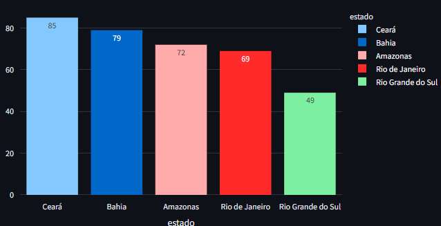

# Projeto de Análise de Dados sobre Feminicídio no Brasil

Este projeto tem como objetivo analisar e visualizar a evolução da taxa de feminicídio no Brasil por estado, utilizando dados do arquivo `homicidios-mulheres.csv`.

✔️ Ferramentas usadas: Python, Pandas, Seaborn, Matplotlib, Plotly, Streamlit
✔️ Foco: Análise Descritiva, Visualização Interativa

<div align="center">
  
</div>


Funcionalidadesme 
Exibe a tabela com os dados tratados.

Visualiza a evolução da taxa de feminicídio por estado ao longo dos anos.

Gráfico interativo dos 5 estados com maior taxa no último ano disponível.

Informações contextualizadas para facilitar a interpretação dos dados.

## Estrutura do projeto

- `dados/homicidios-mulheres.csv`: arquivo bruto com dados originais.
- `scripts/tratamento.py`: script para tratar os dados e salvar em formato pronto para análise.
- `app/dashboard.py`: app em Streamlit para visualização interativa dos dados.
- `requirements.txt`: lista de bibliotecas Python necessárias.

## Como usar

1. Clone o projeto.

2. Instale as bibliotecas necessárias:

```bash
pip install -r requirements.txt

# **Como rodar seu projeto**

1. Certifique-se que o arquivo `homicidios-mulheres.csv` está dentro da pasta `dados/`.

2. No terminal, instale as libs:

```bash
pip install -r requirements.txt

Rode o tratamento:

bash
Copiar código
python scripts/tratamento.py
Rode o app:

bash
Copiar código
streamlit run app/dashboard.py

Contato
Projeto desenvolvido por Tatiana Kami.
Para dúvidas, sugestões ou colaborações, entre em contato:
LinkedIn: https://linkedin.com/in/tatianakami


